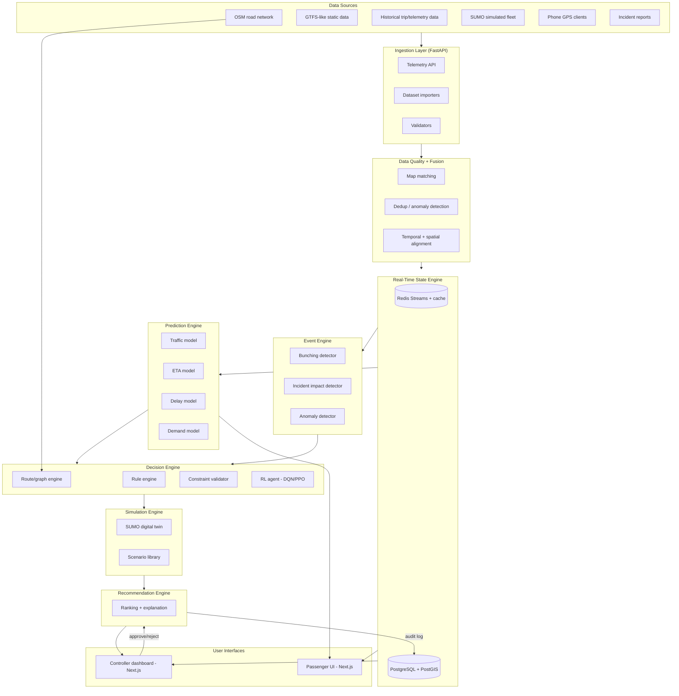

# 3. Component Architecture

## 3.1 System diagram

## 3.2 Services and responsibilities

| Service | Responsibility | Talks to | Owns data |
|---|---|---|---|
| `services/api` | Public REST/WebSocket gateway; auth; request routing to internal services | all internal services | none (stateless) |
| `services/ingestion` | Validate + normalize telemetry/static data/incidents into the common contract (doc 06) | Redis, PostgreSQL | `telemetry` (raw), `incidents` |
| `services/prediction` | Serve traffic/ETA/delay/demand/bunching model inference | Redis (state), model registry | `predictions` |
| `services/optimization` | Decision engine: rule engine, constraint validation, RL agent inference | Redis, RL model registry | `recommendations` (draft) |
| `services/simulation` | SUMO digital twin orchestration; runs scenarios + candidate actions; returns outcome metrics | SUMO/TraCI | `simulation_runs`, `simulation_results` |
| `services/recommendation` | Combine decision + simulation output into ranked, explained recommendation; persist controller decisions | PostgreSQL | `recommendations` (final), `audit_logs` |
| `apps/web` | Controller + passenger dashboards | `services/api` | none |
| `apps/telemetry` | Phone GPS client (browser-based for v1) | `services/ingestion` | none |

Each service is independently deployable (own Dockerfile) and communicates over
HTTP for request/response and Redis Streams for events — no service reaches
into another's database tables directly.

## 3.3 Layering rule (why this separation)

- **Prediction** (ML) answers "what will happen" — pure forecasting, no notion of actions.
- **Decision** (rules + RL) answers "what should we do" — consumes predictions, produces candidate actions.
- **Routing** (graph algorithms: A*/Dijkstra over the OSM graph) answers "what path is physically possible" — a service the decision engine calls, not a model that learns geography from scratch.
- **Simulation** answers "what would happen if we did X" — validates decision engine output before it reaches a human.

This separation is enforced at the service boundary (doc 03.2), not just as a
convention: the RL agent's action space (doc 08) contains abstract actions
(`HOLD_BUS`, `REROUTE_BUS`, ...), never raw waypoints — waypoint-level
feasibility is the routing/constraint engine's job.

## 3.4 Data flow example (bunching scenario)

1. Ingestion receives GPS from Bus 06 and Bus 07 → Fusion computes headway → State engine updates.
2. Prediction engine's bunching model scores headway trend → probability 0.86 within 8 min.
3. Event engine raises a `bunching_risk` event on the Redis event stream.
4. Decision engine consumes the event, enumerates feasible actions (`HOLD_BUS(06, 90s)`, `REROUTE_BUS(07, alt_path)`, `DISPATCH_SPARE`, `NO_ACTION`) via the constraint validator, and asks the RL agent to score them.
5. Simulation engine runs each candidate through SUMO for the local scenario, returns predicted wait/delay/bunching deltas.
6. Recommendation engine ranks candidates, attaches explanation, pushes to controller dashboard.
7. Controller approves → decision + outcome logged to `audit_logs`; once real telemetry confirms the outcome, it's linked back (FR-REC-03).

---
*v1.0 — Phase 0.*
