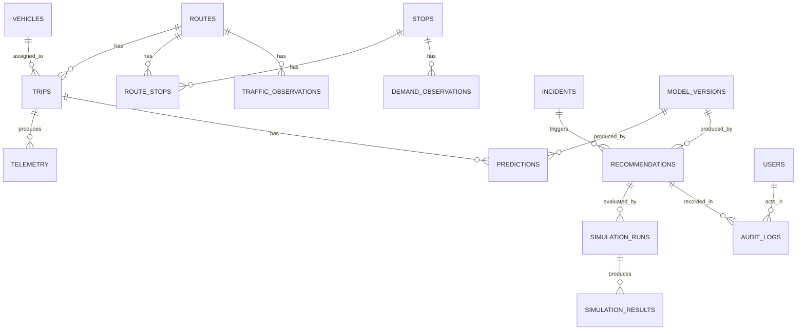

# 4. Data Model (ER)

PostgreSQL + PostGIS. Geometry columns use `GEOMETRY(Point, 4326)` /
`GEOMETRY(LineString, 4326)` (WGS84) unless noted. This is the v1 schema —
expect additive migrations as phases land; do not treat column lists as final.

## 4.1 ER diagram

## 4.2 Tables

### `users`
| Column | Type | Notes |
|---|---|---|
| id | uuid PK | |
| email | text unique | |
| role | text | `controller`, `admin`, `viewer` |
| password_hash | text | |
| created_at | timestamptz | |

### `vehicles`
| Column | Type | Notes |
|---|---|---|
| id | uuid PK | |
| external_code | text unique | e.g. "BUS_07" |
| capacity | int | |
| source | text | `real` \| `simulated` |
| status | text | `active`, `spare`, `maintenance` |

### `routes`
| Column | Type | Notes |
|---|---|---|
| id | uuid PK | |
| code | text unique | e.g. "Route 12" |
| geometry | geometry(LineString,4326) | |
| direction | text | |

### `stops`
| Column | Type | Notes |
|---|---|---|
| id | uuid PK | |
| code | text unique | |
| location | geometry(Point,4326) | |
| capacity_hint | int | for crowding threshold |

### `route_stops`
| Column | Type | Notes |
|---|---|---|
| route_id | uuid FK → routes | |
| stop_id | uuid FK → stops | not unique — a loop route may revisit a stop at a different sequence position |
| sequence | int | order along route |
| scheduled_offset_s | int | seconds from trip start |

PK: **(route_id, sequence)** — not `(route_id, stop_id, sequence)`. Sequence
alone determines position along a route; including `stop_id` in the key
would let two different stops share the same sequence number for the same
route, which is not a valid route. Index `stop_id` separately for
"which routes serve this stop" lookups.

### `trips`
| Column | Type | Notes |
|---|---|---|
| id | uuid PK | |
| route_id | uuid FK → routes | |
| vehicle_id | uuid FK → vehicles | |
| scheduled_start | timestamptz | |
| actual_start | timestamptz nullable | |
| status | text | `scheduled`, `active`, `completed`, `cancelled` |

### `telemetry`
| Column | Type | Notes |
|---|---|---|
| id | bigserial PK | |
| vehicle_id | uuid FK → vehicles | |
| trip_id | uuid FK → trips nullable | |
| ts | timestamptz | |
| location | geometry(Point,4326) | |
| speed_mps | real | |
| heading_deg | real | |
| occupancy | int nullable | |
| matched_edge_id | text nullable | OSM edge id after map-matching |
| source | text | `phone`, `sumo` |

Indexed on `(vehicle_id, ts)`; hypertable-style partitioning by day is a
reasonable future optimization, not required for v1 scale (doc 02.2).

**Idempotency:** unique constraint on `(vehicle_id, ts, source)`. A retried
POST from a flaky phone/SUMO connection carries the same `(vehicle_id,
timestamp, source)` and is written with `ON CONFLICT (vehicle_id, ts,
source) DO NOTHING` — safe to retry without creating duplicate rows that
would double-count in speed/headway aggregation. This is the mechanism
behind FR-INGEST-06's dedup requirement (see doc 06 §6.1a).

### `traffic_observations`
| Column | Type | Notes |
|---|---|---|
| id | bigserial PK | |
| edge_id | text | OSM edge id |
| ts | timestamptz | |
| avg_speed_mps | real | |
| sample_count | int | |
| source | text | `derived`, `sumo`, `historical_import` |

### `demand_observations`
| Column | Type | Notes |
|---|---|---|
| id | bigserial PK | |
| stop_id | uuid FK → stops | |
| ts | timestamptz | |
| boarding_count | int | |
| alighting_count | int | |
| source | text | |

### `incidents`
| Column | Type | Notes |
|---|---|---|
| id | uuid PK | |
| type | text | `accident`, `closure`, `breakdown`, `other` |
| location | geometry(Point,4326) | |
| affected_edge_ids | text[] | nullable |
| severity | text | `low`, `medium`, `high` |
| starts_at | timestamptz | |
| ends_at | timestamptz nullable | |
| reported_by | uuid FK → users nullable | |

### `model_versions`
| Column | Type | Notes |
|---|---|---|
| id | uuid PK | |
| model_name | text | e.g. `traffic_xgb`, `bunching_lstm`, `rl_dqn_v1` |
| version | text | **canonically the MLflow run id** (unambiguous, always unique); an optional separate `display_tag` field may hold a human semantic label like `v1.2` — don't use semantic tags as the canonical `version` value, they're not guaranteed unique across retraining |
| trained_at | timestamptz | |
| metrics | jsonb | MAE/RMSE/etc. at training time |
| artifact_uri | text | DVC/MLflow reference |

### `predictions`
| Column | Type | Notes |
|---|---|---|
| id | bigserial PK | |
| model_version_id | uuid FK → model_versions | |
| target_type | text | `traffic`, `eta`, `delay`, `demand`, `bunching` |
| target_ref_id | **text** | polymorphic: `trip_id`/`stop_id` (uuid, stored as text) for eta/delay/demand, OSM **edge_id** (not a uuid — see doc 07) for traffic. Documented per target_type; never typed `uuid` because edge_id isn't one. |
| horizon_s | int | prediction horizon in seconds |
| value | jsonb | schema depends on target_type (doc 07) |
| generated_at | timestamptz | |

Index: `(target_type, target_ref_id, generated_at DESC)` — the "latest
prediction for this target" lookup the API and decision engine both do on
every request.

### `recommendations`
| Column | Type | Notes |
|---|---|---|
| id | uuid PK | |
| trigger_type | text | `bunching`, `delay`, `incident`, `manual` |
| trigger_ref_id | uuid nullable | e.g. incident_id |
| candidate_actions | jsonb | list of {action, params} evaluated |
| selected_action | jsonb | the recommended one |
| explanation | jsonb | {cause, expected_impact, confidence} |
| model_version_id | uuid FK → model_versions nullable | RL agent version if RL-sourced |
| status | text | `pending`, `approved`, `rejected`, `expired` |
| created_at | timestamptz | |
| decided_at | timestamptz nullable | |
| decided_by | uuid FK → users nullable | |

### `simulation_runs`
| Column | Type | Notes |
|---|---|---|
| id | uuid PK | |
| recommendation_id | uuid FK → recommendations nullable | null for standalone what-if runs |
| scenario_name | text | see doc 09 scenario library |
| action | jsonb | candidate action simulated, or null for baseline |
| seed | int | for reproducibility (FR-SIM-02) |
| started_at | timestamptz | |
| finished_at | timestamptz nullable | |
| status | text | `running`, `completed`, `failed` |

### `simulation_results`
| Column | Type | Notes |
|---|---|---|
| id | bigserial PK | |
| simulation_run_id | uuid FK → simulation_runs | |
| avg_wait_s | real | |
| avg_delay_s | real | |
| bunching_events | int | |
| fleet_utilization_pct | real | |
| fuel_proxy | real | SUMO emission model output |
| co2_proxy | real | |

### `audit_logs`
| Column | Type | Notes |
|---|---|---|
| id | bigserial PK | |
| recommendation_id | uuid FK → recommendations nullable | |
| user_id | uuid FK → users nullable | null for system-generated entries |
| action | text | `viewed`, `approved`, `rejected`, `overridden` |
| reason | text nullable | |
| ts | timestamptz | |

## 4.3 Indexes

Not exhaustive, but every one of these is load-bearing for a specific FR/NFR
— don't defer them as "optimize later":

| Table | Index | Why |
|---|---|---|
| `routes` | GIST on `geometry` | proximity/overlap queries (FR-ROUTE-01) |
| `stops` | GIST on `location` | nearest-stop lookups, map-matching support |
| `incidents` | GIST on `location`; btree on `(starts_at, ends_at)` | "active incidents" queries (FR-INGEST-05), incident-impact detection (FR-EVENT-02) |
| `telemetry` | GIST on `location`; btree on `(vehicle_id, ts)` (existing); unique on `(vehicle_id, ts, source)` | map-matching (FR-FUSE-02), idempotency (above) |
| `traffic_observations` | btree on `(edge_id, ts)` | traffic model feature lookup (doc 07 §7.1) |
| `demand_observations` | btree on `(stop_id, ts)` | demand model feature lookup (doc 07 §7.4) |
| `predictions` | btree on `(target_type, target_ref_id, generated_at DESC)` | "latest prediction for X" (see above) |
| `recommendations` | btree on `(status, created_at)` | `/recommendations?status=pending` (doc 05 §5.6) |
| `simulation_runs` | btree on `(recommendation_id)` | fetching all candidate runs for a recommendation |
| `audit_logs` | btree on `(recommendation_id)`, `(user_id, ts)` | audit trail queries |

## 4.4 Notes

- `predictions.value` and `recommendations.explanation` are `jsonb` because
  their shape varies by target/action type — the authoritative shape for each
  is defined in doc 07 (ML contracts) and doc 08 (RL contracts), not here.
  Do not add a new top-level table per model type; extend the jsonb schema
  and document it.
- All FK relationships are `ON DELETE RESTRICT` by default except `telemetry`
  and `predictions`, which are append-only history and should never block a
  parent delete in practice (vehicles/trips are not expected to be hard-deleted).

---
*v1.0 — Phase 0.*
